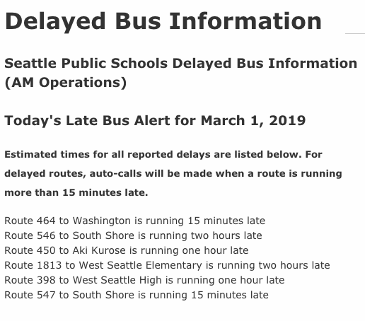
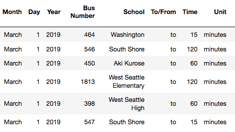
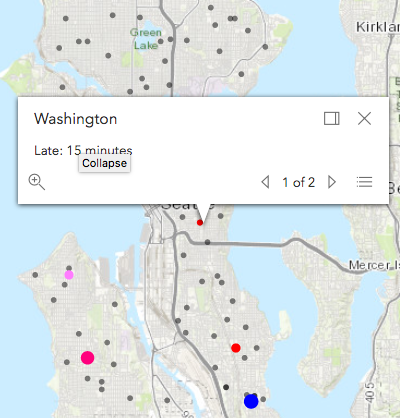
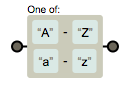
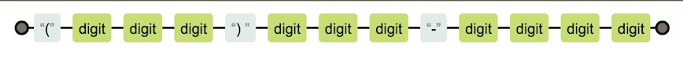

# Introduction to Regular Expressions

## Learning Goals
Be able to answer the following questions:  
- What is a regular expression?
- How can I write a regular expression to match on a specific pattern?
- How can I use regular expressions to speed up my development workflow?

---

# Use Case



---

from this web scraped text: 

```ruby
<p>Route 464 to Washington is running 15 minutes late<br/>
Route 546 to South Shore is running two hours late<br/>
Route 450 to Aki Kurose is running one hour late<br/>
Route 1813 to West Seattle Elementary is running two hours late<br/>
Route 398 to West Seattle High is running one hour late<br/>
Route 547 to South Shore is running 15 minutes late<br/>
Route 630 to Queen Anne is running 15 minutes late<br/>
Route 415 to World School is running 35 minutes late<br/>
Route 578 to TOPS is running 15 minutes late</p>
```

---


to this database| to this visualization
:---:|:---:
   | 

---

# Introduction  

- Identify and process patterns.
- Validate format, e.g. Phone number or zip code.
- Simplify code.
- Useful across multiple languages.

---
# Regular Expression Basics

- A regular expression is a data type, defining a pattern of characters, 
	- just like `String` and `Integer` are data types

- You can form a Regex variable like this:

  
  ```ruby
  pattern = /ada/
  ```

* `/ada/` is a RegEx literal representing a pattern matching any String with the letters "ada" inside it.  
* The two forward slashes indicate a regular expression, or a pattern of text.   
* Anything put between the slashes forms the pattern of text we can match strings against.

---

# ```match``` method

```ruby
pattern = /ada/
```

* Test a String against the regular expression with the Regex's `match` method.  
* `match` compares the string to the pattern, character-by-character.
	* returns a `MatchData` object upon a match 
	* returns `nil` if the String does not match the pattern.  
* `match` will return a `MatchData` object if any substring matches the pattern, not necessarily the entire String.

---

**Let's make a ruby file `regex-lesson.rb`**


### Example 
<details>
  <summary>
   Live code: match method
  </summary>

```ruby
pattern = /ada/

if pattern.match("ada lovelace")
  puts "The String has ada in it!"
else
  puts "It doesn't match"
end

# => "The String has ada in it!"
```
</details>

### Practice

Rewrite the code snippet we just wrote together using the **ternary** operator.

<details>
  <summary>
  Check your answer here
  </summary>
  
	
  ```ruby
  puts pattern.match("ada lovelace") ? "The String has ada in it!" : "It doesn't match"
  ```

</details>


---

# =~ matching operator

* Regular Expressions can also be compared using the `=~` operator.  
* The `=~` operator returns the index of the first match in the string.
* Both `match` and `=~` will return a truthy result if any substring matches the pattern. 

---

# =~ matching operator

### Example

<details>
  <summary>
   =~ example
  </summary> 

```ruby
pattern = /ada/

pattern =~ 'ada'	# => 0
pattern =~ "learn at ada academy." # => 9 
```
</details>


### Practice

<details>
  <summary>
   What will the following return?
  </summary> 


```ruby
pattern =~ "I love ada developers academy" 
pattern =~ "Ada Developers Academy"
pattern =~ "Seattle's a great city"
pattern.match('ada')
pattern.match('hello world')
```
</details>

---
## Beyond the basics

To match a pattern exactly, the regex needs to be more specific using special characters to indicate the start and end of the string. _More on this later..._

What if you wanted to match either "Ada" or "ada"? 
* To handle both lower and upper case "Ada," we need to provide our pattern options to match against.  
* To provide a list of possible characters we can use **Character sets.**

---

# Character Sets

* **character set** AKA **character class**: a way to tell the regex engine to match only one out of several characters.  
* Define a character set with square brackets.  
	* For example `/[Ss]/` will match both capital and lowercase S.  
	* Combining the character set with the previous larger literal, `[Aa]da` will match both "Ada" and "ada", but not "aDa".  

* If you want the **whole** regex to ignore case you can use the `i` flag:

  <details>
    <summary>
     Example: Character Sets
    </summary> 

  ```ruby
  pattern = /ada/i
  pattern = /[Aa][Dd][Aa]/

  pattern =~ 'ADA' # => 0
  pattern =~ 'aDA' # => 0
  pattern =~ 'aDa' # => 0
  ```
  </details>

---

## Character Sets (continued)

You can also adjust the character set to accept a range of characters.  For example:  
- `/[A-Z]/`  will accept a single character in the range A to Z (must be capitalized)
- `/[0-9]/` will accept a single digit.  
- `/[A-Za-z]/` or `/[A-Z]/i` will accept any alphabetic characters.



---

## Practice with character sets

Write a regex pattern to match any alphanumeric digit like "a", "W", or "0"? Make sure your test to code.

<details>
  <summary>
  Check your answer here
  </summary>
	
  ```ruby
  pattern = /[A-Za-z0-9]/
  # pattern = /[A-Z0-9]/i
  
  ```
  
  Test your code on the strings contained in the following list. *Suggestion:* Use a for each loop and the ternary operator. 
    
  ```ruby
  test_strings = ['a','W', '0', '-', '*']  
  ```

  <details>
  
  <summary>
	test code
    </summary>

  ``` ruby
  test_strings.each do |item|
      puts pattern.match(item) ? '#{item} is valid' : '#{item} is not valid'
  end
  ```
  </details>
</details>


---

## More Practice with character sets

1. Write a regex pattern to match a string that contains a vowel.
2. Write a regex pattern that matches the string "gray" and "grey."
3. Write a regex pattern that matches double digit numbers that are multiples of 5.
4. Write a regex pattern that matches 3 letter words that rhymn with "bad."

<details>
  <summary>
  Check your answers here
  </summary>
  
  ```ruby
  # 1) contains a vowel
  pattern = /[aeiuo]/
  
  # 2) matches "gray" and "grey"
  pattern = /gr[ae]y/
  
  # 3) multiples of 5
  pattern = /[1-9][05]/
  
  # 4) 3 letter words that rhymn with "bad."
  pattern = /[dfhlmprst]ad/
  
  ```
  
<details>


---

# The Wildcard and Quantifiers

* _wildcard_ character: a period (`.`)
	* accepts any character.
* _quantifiers_:  `*`, `+` and `?`
	* used for characters that are optional or can repeat. 

* **These characters are summarized in the following table:**


Character | Meaning            | Example
---       | ---                | ---
`.`       | Any one character  | `/a.a/` matches `ada`, `ava`, and `a!a`

---
Character | Meaning            | Example
---       | ---                | ---
`*`       | Preceding token may occur **zero** or more times | `/ad*a/` matches `aa`, `ada`, and `adddda`<br><br>`/[0-9]*/` matches `1`, `345`, and the empty string<br><br>`.*` matches any string


---

Character | Meaning            | Example
---       | ---                | ---
`+`       | Preceding token may occur **one** or more times. | `/ad+a/` matches `ada` and `adddda` but **not** `aa`<br><br>`/[0-9]+/` matches `1` and `345` but **not** the empty string<br><br>`.+` matches any string **except for** the empty string

---

Character | Meaning            | Example
---       | ---                | ---
`?`       | Preceding token is optional (may occur zero or one times) | `/ad?a/` matches `aa` and `ada`<br><br>`/[0-9]/` matches `2` and the empty string but not `27` or `356`<br><br>`.?` matches any one character or the empty string

---
## Practice

Write a regular expression to match a valid email of form `name@domain.tld`
- Matches `dee@adadev.org`, `adalovelace@gmail.com`, `magictavern@puppies.supplies`
- Rejects `dan@adadev.`, `charles.com`, `@adadev.org`, `sarah@.org`
- Use `\.` for a literal period *(more on this later)*
- With your tablemates, decide on what consist a valid e-mail address and choose several test strings.
<details>
  <summary>
  Check your answer here
  </summary>
	
  ```ruby
  pattern = /.+@.+\..+/

  test_strings = [`dee@adadev.org`, `adalovelace@gmail.com`, 
  `magictavern@puppies.supplies`,`dan@adadev.`, 
  `charles.com`, `@adadev.org`, `sarah@.org`]
  ```
</details>

---

# The NOT `^` Character

* Use the `^` character and square brackets to exclude a group of characters or a type of character.
	* can be easier than list all the valid possibilities.  
In that case you need the `^` character and the square brackets.  

* For example:  `/[^abc]/` excludes a, b and c.

* What do the following patterns exclude?

```ruby
/[^0-9]/
/Ada is number [^2-9^a-z^A-Z^0]/ 
```
---

## Practice

How can you write a regex using exclusion which would accept `dog`, `sog`, and `hog`, but exclude `bog`?

<details>
  <summary>
  Check your answer here
  </summary>
	
  ```ruby
  pattern = /[^b]og/
  
  test_strings = ['dog', 'sog', 'hog', 'bog']
  ```
</details>

---

# Escape characters
* The backslash character `\` is used to indicate special characters
	*  e.g. `+`, `*`, `.`
* The backslash character `\` is also used as a shortcut for common classes of characters.

* Some common escape characters are summarized on the next slide.

---
# Escape characters

Some examples include:

| Escape Character |  |  
| --- | --- |
| `\n`  |  newline character |
| `\s`  |  Any whitespace character (space, tab, newline) |
| `\S`  |  Any non-whitespace character |
| `\d`  |  Any digit |
| `\D`  |  Any non-digit |
| `\.`, `\+`, `\*`, etc.  | The literal character following the backslash, for example `\\` searches the String for a backslash, while `\.` looks for a period.  |

---

## Practical Example:

-  Use regex to validate a US phone number in the format 
	(ddd) ddd-dddd.
  	* `/\(\d\d\d\) \d\d\d\-\d\d\d\d/`



  - This regular expression takes 3 digits inside parentheses followed by a space, then three digits a dash and then 4 digits.  We will see how to simplify this a bit later.

---

## Practice

Write a regex for any amount of US currency, for example it should match `$3.25`, `$102.73`, and `$0.25`.

<details>
  <summary>
  Check your answer here
  </summary>
  
  ```ruby
  pattern = /\$\d+\.\d\d/
  
  test_strings = ['$3.25', '$102.73', '$0.25', '$1000.73',
  '$10.7', '$10.707']
  ```
</details>

---

## Start and End of a String

* By default a regex will match a string if any part of the string matches. 
* Sometimes you want your regex to be at the very beginning or very end of a string, or to match the whole string with nothing left over. 
* In this case you can use the special characters `^` and `$`.

* `^` indicates the beginning of a string
	- `/^ada/` matches `ada` and `ada end` but not `start ada`

* `$` indicates the end of a string.
	- `/ada$/` matches `ada` and `start ada` but not `ada end`

* It is common to combine `^` and `$` in order to match an entire string.

---

## Practice

Write a regex that will match only strings without any leading whitespace.
- `"ada"`, `"ada academy"` and `"ada "` all match
- `"  ada"`, `"  ada "` and `" "` do not match
- *Hint: refer to the escape characters table*

<details>
    <summary>
    Check your answer here
    </summary>
	   
```ruby   
pattern = /^\S.*/

test_strings = ['ada', 'ada academy', 'ada ', ' ada', ' ada ', ' ']    
```
</details>


---

# Repetitions

* `*` and `+` characters allow a token to be repeated
* Often you will want to limit a token to a specific number of repetitions.
	* Can you think of an example?

* A number placed in the curly braces `{}` will indicate how many times the preceding token can be repeated.  
	* e.g. `/[abc]{3}/` will allow the letters `a`, `b` or `c` to be repeated three times
		* `"aaa"`, `"abc"`,  and `"cab"` all match.

* A range of repetitions can also be repeated by using two parameters in the curly braces.  
	* e.g. `/[abc]{3, 5}/` would allow the characters to repeat between 3 and 5 times.

---

## Practice

Use repetiions to rewrite the regex to validate a US phone number in the format (ddd) ddd-dddd.

<details>
    <summary>
	Check your answer
    </summary>
  	
```ruby  
pattern = /\(\d{3}\) \d{3}\-\d{4}/
```
    
</details>

---

# Reflection

Please share one thing you learned/observed and one question you have using [this form](https://docs.google.com/forms/d/e/1FAIpQLSddsuNWLiHHPki0FSvMH3LKBX8p7AVevMeWmxEjpg7h9OVmbg/viewform?usp=sf_link).
      
